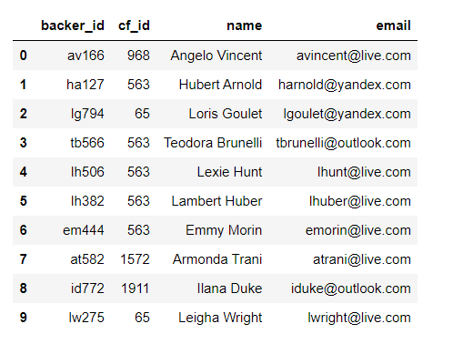
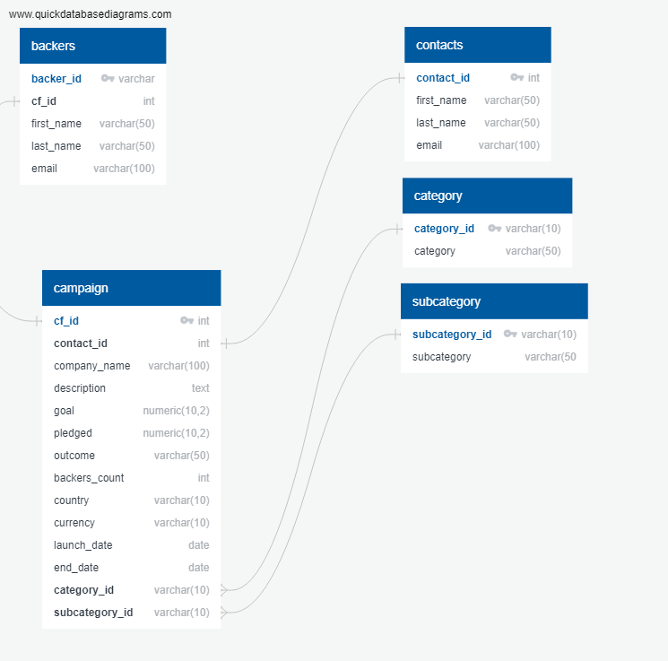
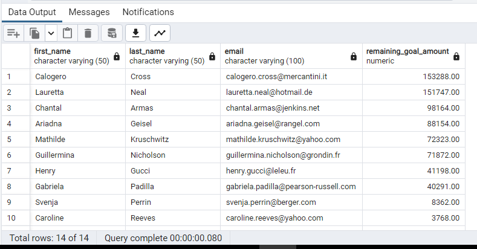
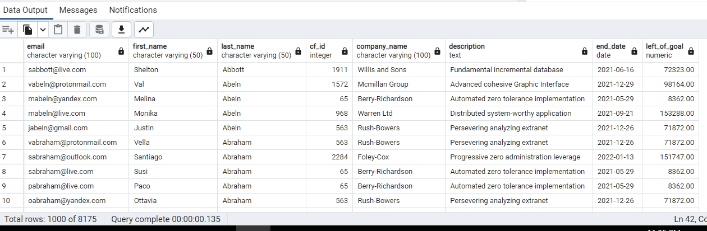

# Crowdfunding-ETL: Extract, Transform, Load
## Background
Independent Funding is a crowdfunding platform for funding independent projects. Their company has been growing, so they need to move all of their accessible data from a large Excel file onto a PostgreSQL database.

## Analysis
In this analysis, Python, Pandas, and Jupyter notebooks were used to do the extract and transform phases. 

For the extract phase, we extracted and transformed raw contact information from a CSV file to create a DataFrame that was then exported as a CSV file. 

In the load phase, the dataset was used to create an ERD and table schema to create a new table in the crowdfunding_db database. Once this was created, the CSV file with backers' information was uploaded into the table.

The data was transformed via formatting, splitting, converting data types, and restructuring to create a DataFrame that we could then load into a postgreSQL database as a CSV file.

Next, using the ERD, a backers table was created with the primary and foreign keys. Once exported into a database schema as a PostgreSQL file, we created a table in the crowdfunding_db database. It was then uploaded using pgAdmin into a csv.

## Results
Lastly, a data analysis was performed on the crowdfunding_db by using SQL queries.

Our clients' boss wanted to send an email to each contact and backer of every live campaign to inform them of how much of the goal remains. 

